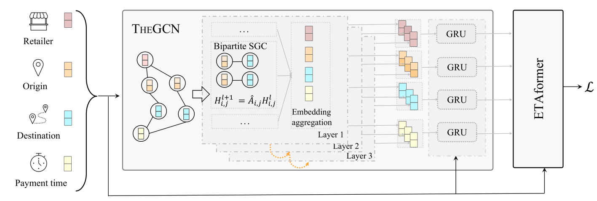

# IGT-WSDM23
Official Pytorch Code for "Inductive Graph Transformer for Delivery Time Estimation", WSDM 2023

## Framework            



## How to run
```python
python main.py -d toy -m IGT
```

## Configuration
You may configure datasets and models in `configs`.

## Datasets
Under PIPL, we are unable to provide the evaluated datasets for public use. However, we generate a toy dataset (`datasets/toy`) with the same format to demonstrate how IGT works.

## Citation
```
@inproceedings{zhou2022inductive,
  title={Inductive Graph Transformer for Delivery Time Estimation},
  author={Zhou, Xin and Wang, Jinglong and Liu, Yong and Wu, Xingyu and Shen, Zhiqi and Leung, Cyril},
  booktitle={Proceedings of the Sixteenth ACM International Conference on Web Search and Data Mining},
  year={2023}
}
```

---
No commercial use. License reserved by authors.